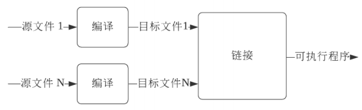
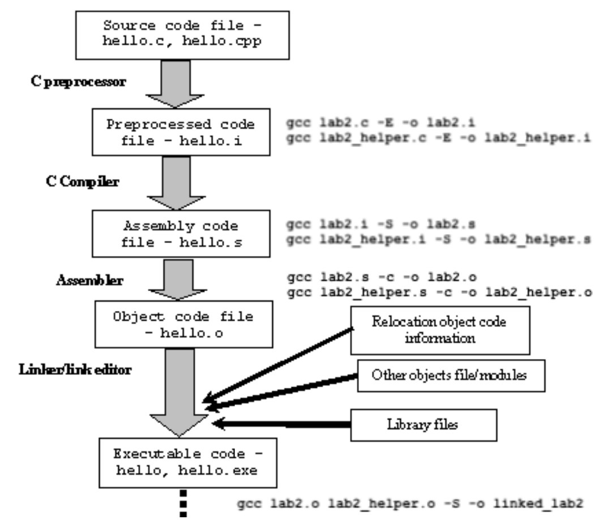

# 第0章：C++介绍

## 1. 什么是C++

- C语言的扩展
  - 关注性能
    - 与底层硬件紧密结合
    - 对象生命周期的精确控制
    - Zero-overhead Abstraction
  - 引入大量特性，便于工程实践
    - 三种编程范式：面向过程、面向对象、泛型
    - 函数重载、异常处理、引用
- 一系列不断衍进的标准集合
  - C++98/03, C++11, C++14, C++17, C++20, C++23?
  - 语言本身的改进
    - Memory Model
    - Lambda Expression
  - 标准库的改进
    - type_traits/ranges
    - auto_ptr
- C++标准的工业界实现
  - MSVC/GCC/Clang...
  - 每个编译器可能并不完全遵照标准
    - [http://godbolt.org/z/cKMjK3](http://godbolt.org/z/cKMjK3)
  - 不同的实现存在差异
    - [https://godbolt.org/z/6hnPhY](https://godbolt.org/z/6hnPhY)
- 不能脱离具体的语境讨论C++
- 编写程序时要注重
  - 性能
  - 标准

## 2. C++的开发环境与相关工具

- Visual C++ / GCC (G++) / Clang (Clang++)...
- 集成开发环境：Visual Studio / CodeLite / Code::blocks / Eclipse...
- 工具
  - /usr/bin/time
  - valgrind
  - cpp reference
  - Compiler explorer
  - C++ insights

## 3. C++的编译/链接模型

- 简单的加工模型

  

- 问题：无法处理大型程序

  - 加工耗时较长
  - 即使少量修改，也需要全部重新加工

- 解决方案：分块处理

  

- 好处

  - 编译耗资源但一次处理输入较少
  - 链接输入较多但处理速度较快
  - 便于程序修改升级

- 由“分块处理”衍生出的概念

  - 定义/声明
  - 头文件/源文件
  - 翻译单元
    - 源文件+相关头文件（直接/间接）-应忽略的预处理语句
  - 一处定义原则：
    - 程序级：一般函数
    - 翻译单元级：内连函数、类、模板

- 预处理
  - 将源文件转换为翻译单元的过程
  - 防止头文件被循环展开
    - `#ifdef`解决方案
    - `#pragma once`解决方案
- 编译
  - 将翻译单元转换为相应的汇编语言表示
  - 编译优化
    - [https://godbolt.org/z/zh9aqx](https://godbolt.org/z/zh9aqx)
  - 增量编译V.S.全部编译
- 链接
  - 合并多个目标文件，关联声明与定义
  - 连接(Linkage)种类：内部连接、外部连接、无连接
  - 链接常见错误：找不到定义
- C++的编译/链接过程是复杂的，预处理、编译与链接都可能出错
- 编译可能产生警告、错误，都要重视

## 小结

- C++是一门注重性能的程序设计语言
- C++的标准经历了一系列的衍化，还在不断发展
- 标准与具体实现之间存在差距
- C++源程序转换成可执行文件是相对复杂的过程，主要包含预处理、编译、链接等阶段，每一阶段都可能引入错误
