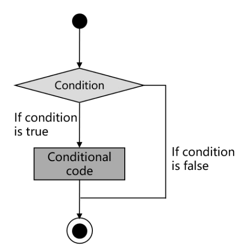

# 第一章 C++初探

## 1. 从Hello World谈起

- 函数：一段能被反复调用的代码，可以接收输入，进行处理并（或）产生输出
  - 返回类型：表示了函数返回结果的类型，可以为`void`
  - 函数名：用于函数调用
  - 形参列表：表示函数接收的参数类型，可以为空，可以为`void`，可以无形参
  - 函数体：具体的执行逻辑

- `main`函数：特殊的函数，作为整个程序的入口

  - 返回类型为`int`，表示程序的返回值，通常用0来表示正常返回
  - 形参列表可以为空

- （内建）类型：为一段存储空间赋予实际的意义

  

- 语句：表明了需要执行的操作

  - 表达式+分号的语句
  - 语句块
  - `if`/`while`等语句

- 注释：会被编译器忽略的内容

  - 用于编写说明或去除不适用的语句
  - 两种注释形式：`/**/`与`//`

## 2. 系统I/O

- `iostream`：标准库所提供的IO接口，用于与用户交互
  - 输入流：`cin`；输出流：`cout`/`cerr`/`clog`
  - 输出流的区别：
    - 输出目标；
    - 是否立即刷新缓冲区
  - 缓冲区与缓冲区刷新：`std::flush;` `std::endl;`
- 名字空间：用于防止名称冲突
  - `std`名字空间
  - 访问名字空间中元素的3种方式：
    - 域解析符`::`；
    - `using`语句；
    - 名字空间别名
  - 名字空间域名称改编(name mangling)
- C/C++系统IO比较
  - `printf`：使用直观，但容易出错
  - `cout`：不容易出错，但书写冗长
  - C++20格式化库：新的解决方案

## 3. 猜数字与控制流

- `if`语句：用于分支选择
  - 条件部分：用于判断是否执行
  - 语句部分：要执行的操作
- `==`与`=`操作
  - `=`操作：用于赋值，将数值保存在变量所对应的内存中
  - `==`操作：用于判断两个值是否相等
  - 可以将常量放在`==`左边以防止误用

- `while`语句：用于循环执行
  - 条件部分：用于判断是否执行
  - 语句部分：要执行的操作

## 4. 结构体与自定义数据结构

- 结构体：将相关的数据放置在一起
  - 可以通过点操作(`.`)访问内部元素
  - 可以作为函数的输入参数或返回类型
  - 可以引入成员函数，更好地表示函数与数据的相关性