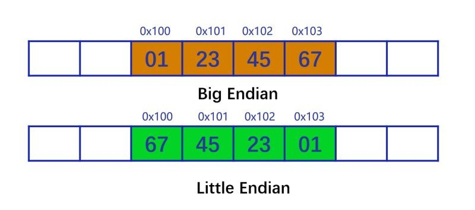
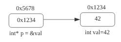
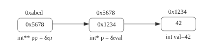

# 第2章：对象与基本类型

## 1. 初始化与赋值

- 初始化与值在程序中将某一个值与一个对象关联起来
  - 值：字面值、对象（变量或常量）所表示的值...
  - 标识符：变量、常量、引用...
  - 初始化操作：
    - 在内存中开辟空间，保存相应的数值
    - 在编译器中构造符号表，将标识符与相关内存空间关联起来
  - 值与对象都有类型
  - 初始化与赋值操作可能涉及到类型转换

## 2. 类型详述

- 类型是一个编译期概念，可执行文件中不存在类型概念
- C++是强类型语言，<u>（Python虽然是弱类型语言但是也存在类型概念）</u>
- 引入类型可以更好地描述程序，防止误用
- 类型描述：
  - 存储所需的空间尺寸（`sizeof()`，标准并没有严格限制）
  - 取值空间（`std::numeric_limits`，超过范围可能产生溢出）

```c++
std::cout << std::numeric_limits<int>::min() << std::endl;
std::cout << std::numeric_limits<int>::max() << std::endl;

std::cout << std::numeric_limits<unsigned int>::min() << std::endl;
std::cout << std::numeric_limits<unsigned int>::max() << std::endl;

// 取值溢出
unsigned int x = std::numeric_limits<unsigned int>::max();
x = x + 1;
std::out << x << std::endl; // x = 0
int y = std::numeric_limits<int>::max();
y = y + 1;
std::out << y << std::endl; // y = -2147483648
```

- - 类型描述对齐信息（`alignof`）

```c++
struct Str
{
    // 8000
    char b;  // 1 byte
    
    // 8001 -> 8003  (wrong)
    // 8004 -> 8007  (rignt)
    int x;     // 4 byte
    
    // So Str: 8000 -> 8007
};

int main() {
    std::cout << alignof(int) << std::endl;         // 4
	std::cout << alignof(char) << std::endl;      // 1
    
    // sizeof(Str) is much larger than alignof()
    std::cout << sizeof(Str) << std::endl;          // 8, not 5
    std::cout << alignof(Str) << std::endl;         // 4
    
    return 0;
}
```

理解：

```cpp
memory byte    0  1  2  3     4  5  6  7       8 9 10 11
     integer         goooood
                                    baaaaaaaaad
```

- - 可以执行的操作

- 类型可以划分为基本类型与复杂类型

  - 基本（内建）类型：C++语言所支持的类型

    - 数值类型

      - 字符类型（`char`, `wchar_t`, `char16_t`, `char32_t`）

      - 整数类型

        带符号整数类型：`short`, `int`, `long`, `long long`

        无符号整数类型：`unsigned + 带符号整数类型`

        *注：*`usigned`特指`unsigned int`，简写。

      - 浮点类型

        `float`, `double`, `long double`

    - `void`

  - 复杂类型：由基本类型组合、变种所产生的类型，可能是标准库引入，或自定义类型

- 与类型相关的标准未定义部分

  - `char`是否有符号
  - 整数中内存中的保存方式：大端 小端

  

  - 每种类型的大小（间接影响取值范围）
    - C++中引入了固定尺寸的整数类型，如`int32_t`

### 2.1 字面值及其类型

- 字面值：在程序中直接表示为一个具体数值或字符串的值
- 每个字面值都有其类型
  - 整数字面值：`20`（十进制）、`024`（八进制）、`0x14`（十六进制）——> `int`型
  - 浮点数：`1.3`、`1e8` ——> `double`型
  - 字符字面值：`'c'`、`'\n'`、`'\x4d'` ——> `char`型
  - 字符串字面值：`'Hello~~\0~~'` ——> `char[6]`型
  - 布尔字面值：`true`、`false` ——> `bool`型
  - 指针字面值：`nullptr` ——> `nullptr_t`型
- 可以为字面值引入前缀或者后缀以改变其类型
  - `1.3` (double) ——> `1.3f` (float)
  - `2` (int) ——> `2ULL` (unsigned long long)
- 可以引入自定义后缀来修改字面值类型
  - ——> user defined character literals
  - 注意自定义后缀的形参可选存在限制

### 2.2 变量及其类型

- 变量：对应了一段存储空间，可以改变其中的内容
- 变量的类型在其首次声明（定义）时指定：
  - `int x`：定义一个变量`x`，其类型是`int`
  - 变量声明与定义的区别：`extern`前缀

```c++
// 定义
int g_x;

// 声明
extern int g_x;

// 注意：
// 此时声明同时赋值就变成了定义
extern int g_x = 6;
```

- 变量的初始化与赋值
  - 初始化：在构造变量之初为其赋予的初始值
    - 缺省初始化
      - 如果是全局变量会缺省为0；
      - 如果是局部变量则缺省为随机值；
    - 直接/拷贝初始化

```c++
// 拷贝初始化
int x = 10;

// 直接初始化，两种
int y(10);
int z{10};
```

- 其他初始化

- 赋值：修改变量所保存的内容

### 2.3 （隐式）类型转换

```c++
// double ——> float
// a kind of promotion, 不会产生精度损失
float x = 1.3;
```

- 为变量赋值时可能涉及到类型转换
  - `bool`与整数之间的转换
  - 浮点数与整数之间的类型转换
- 隐式类型转换不只发生在赋值时
  - `if`判断
  - 数值比较
    - 无符号数据与带符号数据之间的比较
    - `std::cmp_XXX` （C++20）

*注：*

```c++
int main() {
    // 无符号数和有符号数之间进行比较时，先进行类型转换，将带符号数转换成无符号数后进行比较
    int x = -1;
    unsigned int y = 3;
    std::cout << (x < y) << std::endl;
    
    return 0;
}
```

## 3. 复合类型：从指针到引用



```c++
int main() {
    int x = 42;
    int y = 56;
    int* p = &x;
    p = &y;
    
    char z = 33;
    int* p1 = &x;      // p1 ——> 8 byte
    char* p2 = &y;   // p2 ——> 8 byte
}
```

### 指针：一种间接类型

- 特点：

  - 可以“指向”不同的对象（首地址）
  - 具有相同的尺寸

- 相关操作

  - `&` ——> 取地址操作符
  - `*`  ——> 解引用操作符

- 指针的定义
  - `int* p = &val;`
  - `int* p = nullptr;`

- 关于`nullptr`
  - 一个特殊的对象（类型为`nullptr_t`，但通常不会使用），表示空指针
  - 类似于C中的`NULL`，但更加安全，<u>（避免函数重载时报错）</u>

- 指针与bool的隐式转换：非空指针可以转换为`true`；空指针可以转换为`false`
- 指针的主要操作：解引用；增加、减少；判等

```c++
int* p = &x;
int* q = &x;

p = p + 1;      // 指针指向下一个地址 +4，数组中

std::cout << (p == q) << '\n';  // 判等
// 注意是在栈还是在堆中构建对象判等
// 尽量在一个数组的内部进行比较
// 对不同的对象可以对比是否指向相同对象，而不是对比大小（因为指向地址不能确定）
```

- `void*`指针
  - 没有记录对象的尺寸信息，<u>可以保存任意地址</u>
  - 支持判等操作

```c++
#include <iostream>
void fun(void* param)
{
    std::cout << (param + 1) << std::endl; // ERROR
}

int main()
{
    int x = 42;
    int* r = &x;
    std::cout << r << std::endl;
    std::cout << (r + 1) << std::endl;
    fun(r);
}
```

> ERROR:
>
> arithmetic on a pointer to void
>
> 因为`void*`丢失了地址信息。

### 指针的指针



- 指针 V.S. 对象
  - 指针复制成本低，读写成本高<u>（涉及到两次地址访问）</u>
  - <u>指针是对对象的间接引用，可以减少程序传输复制的成本</u>
  - 传值？传址？

```c++
void fun(int param)
{
    param = param +1;
}

int main()
{
    int x = 3;
    fun(x);
    std::cout << x << std::endl; // x = 3
    // 传值
	// x的值拷贝到param中，在fun函数中对param的操作不影响x的值
    // 如果想对x值改变可以改成指针引用
} 
```

```c++
void fun(int* param)
{
    *param = *param +1;
}

int main()
{
    int x = 3;
    int* p = &x;
    fun(p);
    std::cout << x << std::endl; // x = 4
    // 传址
} 
```

- 指针的问题
  - 可以为空
  - 地址信息可能非法
  - 解决方案：引用

### 引用

- 引用
  - `int& ref = val;`
  - 是对象的别名，不能绑定字面值
  - 构造时绑定对象，在其生命周期内不能绑定其他对象（赋值操作符会改变对象内容）
  - 不存在空引用，但可能存在非法引用——总的来说比指针安全
  - 属于编译期概念，在底层还是通过指针实现

```c++
#include <iostream>
int main()
{
    int x = 3;
    int y = 0;
    int& ref = x; 
    // 引用只能改变绑定对象的内容
    ref = y;
    
    int* ptr = &x;
    *ptr = y; // 改变x
    ptr = y;  // 改变ptr本身
}
```

```c++
#include <iostream>
int& fun()
{
    int x;
    return x;
}

int main()
{
    int& res = fun();
}
```

```c++
#include <cstdio>

int main()
{
    int x;
    
    // 以下两句作用一致
    // 引用和指针密切相关
    int* ptr = &x; *ptr = 1;
    int& ref = x; ref = 1;
}
```

- 指针的引用
  - 指针是对象，因此可以定义引用
  - `int* p = &val;` `int*& ref = p;` ——> 对指针的引用
  - 类型信息从右向左解析
  - 不能引用的引用

## 4. 常量与常量表达式

- 常量与变量相对，表示不可修改的对象
  - 使用`const`声明常量对象
  - 是编译期概念，编译器利用其
    - 防止非法操作，如常量不能进行写操作
    - 优化逻辑程序
- 常量指针与顶层常量（top-level const）
  - `const int* p;` ——> 底层常量
  - `int* const p;` ——> 顶层常量
  - `const int* const p;`

```c++
int main()
{
    int x = 4;
    &x;  // int* ——> const int* 隐式转换
    const int* ptr = &x;
    *ptr;  // const int
    /* 错误，const int* —x—> int*
    const int z = 3;
    int* ptr2 = &z;
    */
    /* 正确
    const int w = 3;
    int* ptr3 = &w;
    */
    
    int* const ptr1 = &x;
    *ptr1;  // int
}
```

- 常量引用（也可绑定变量）

  - `const int&`
  - 可读但不可写
  - 主要用于函数形参
  - 可以绑定字面值

- 常量表达式（从C++11开始）

  - 使用`constexpr`声明
  - 声明的是*<u>编译器变量</u>*
  - 编译器可以利用其进行优化

  ```c++
  int x;
  std::cin >> x;
  
  const int y1 = x;
  const int y2 = 3;
  
  // y1需要在程序运行期进行处理，y2可以在编译器处理，存在一定的优化，二者处理逻辑不同
  if (y1 == 3)
  {
      // ...
  }
  if (y2 == 3)
  {
      // ...
  }
  ```

  - 常量表达式指针：`constexpr`位于`*`左侧，但表示指针是常量表达式

  ```c++
  constexpr int y2 = 3; // y2的类型是const int
  
  constexpr const char* ptr = "123"; // ptr的类型是const char* const
  ```

  ```c++
  #include <iostream>
  #include <type_traits>
  
  int main()
  {
      constexpr const char* ptr = "123"; // ptr的类型是const char* const
      std::cout << std::is_same_v<decltype(ptr), const char* const> << std::endl; // 1
  }
  ```

  

## 5. 类型别名与类型的自动推导

- 可以为类型引入别名，从而引入特殊的含义或便于使用（如：`size_t`）

- 两种引入类型别名的方式
  - `typedef int MyInt;`
  - `using MyInt = int;` （从C++11开始）
- 使用using引入类型别名更好
  - `typedef char MyCharArr[4];`
  - `using MyCharArr = char[4];`
- 类型别名与指针、引用的关系
  - 应将指针类型别名视为一个整体，在此基础上引入常量表示指针为常量的类型
  - 不能通过类型别名构造引用的引用

- 类型的自动推导

  - 从C++11开始，可以通过初始化表达式自动推导对象类型

  - 自动推导类型并不意味着弱化类型，对象还是强类型

  - 自动推导的几种常见类型

    - `auto`：最常用的形式，但会产生类型退化

    ```C++
    auto x; // wrong
    ```
    
    类型退化：
    
    ```c++
    int x1 = 3;
    int& ref = x1;
    
    auto y = ref; // int& ——> int
    // 类型退化：右值类型发生改变
    // 类似地还有const int& ——> int
    ```
    
    - `const auto` / `constexpr auto`：推导出的是常量/常量表达式类型
    - `auto&`：推导出引用类型，避免类型退化
    - `decltype(exp)`：返回`exp`表达式的类型（左值加引用），不会产生退化
    - `decltype(val)`：返回`val`的类型
    - `decltype(auto)`：从C++14开始支持，简化`decltype`使用
    - `concept auto`：从C++20开始支持，表示一系列类型（`std::integral auto x = 3`）

## 6. 域与对象的生命周期

- 域（scope）表示了程序中的一部分，其中的名称有唯一的含义
- 全局域（global scope）：程序最外围的域，其中定义的是全局对象
- 块域（block scope）：使用大括号所限定的域，其中的定义的是局部对象
- 还存在其他的域：类域，名字空间域...
- 域可以嵌套，嵌套域中定义的名称可以隐藏外部域中定义的名称
- 对象的生命周期起始于被初始化的时刻，终止于被销毁的时刻
- 通常来说
  - 全局对象的生命周期是整个程序的运行期间
  - 局部对象生命周期起源于对象的初始化位置，终止于所在域被执行完成
