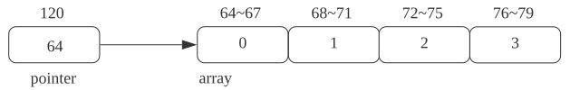

# 第三章 字符串、向量和数组
## 1. 数组
- 将一到多个相同类型的对象（元素）串联到一起所组成的类型
  
  - > 数组元素应为对象，因此不存在引用的数组
  
  - int a ——> int b[10]
  ```c++
  // 二者不一样
  int x;
  int arr[1];    
  ```
  
  - 数组的初始化方式：
    - 缺省初始化
    - 聚合初始化（aggregate initialization）
  
- 注意事项
  - 不能用`auto`来声明数组类型

  ```c++
  #include <iostream>
  #include <type_traits>
  #include <typeinfo>
  int main()
  {
      auto b = {1, 3, 4};
      std::cout << typeid(b).name() << std:
  }
  ```

  注：`int`数组在用`auto`声明时会退化成int类型的指针

  - 数组不能复制
  - 元素个数必须是一个常量表达式（编译期可计算的值）

    > - 数组维度在编译期确定
    >
  - 字符串数组的特殊性

  ```c++
  char str[] = "Hello";                            // char[6]，自动补位 \0
  char str[] = {'H', 'e', 'l', 'l', 'o', '\0'}        // char[6]
  char str[] = {'H', 'e', 'l', 'l', 'o'}              // char[5]
  cahr str[5] = {'H', 'e', 'l', 'l', 'o'}            // wrong x
  ```

- 数组的复杂声明

  - 指针数组与数组的指针
    - 存放指针的数组：`int *ptrs[10];`
    - 数组的指针：`int (*Parray)[10] = &arr;`，`Parray`指向一个含有10个整数的数组
    - 数组的引用：`int (&arrRef)[10] = arr;`，`arrRef`引用一个含有10个整数的数组


  ```c++
  int main()
  {
      int x1;
      int x2;
      int x3;
      int *a[3] = {&x1, &x2, &x3}; // 指针数组
      
      int b[3];
      int (*a) [3] = &b;                  // 数组的指针
  }
  ```

  - 声明数组的引用

  *注：不能用引用的数组。*

- 数组中的元素访问

  - 数组下标通常被定义为`size_t`类型 ——> `#include <cstddef>`
  - 数组对象是一个左值
  - 使用时通常会转换成相应的指针类型
  - `x[y] -> *((x)+(y))`
  - > 注意对下标值是否在合理范围的检查以防止溢出。

### 从数组到指针

- 数组到指针的隐式转换

  - 使用数组对象时，通常情况下会产生数组到指针的隐式转换
  - 隐式转换会丢失一部分类型信息
  - 可以通过声明引用来避免隐式转换

  

  - 注意：不要使用`extern`指针来声明数组
    - Unknown Bounded Array声明

- 获得指向数组开头与结尾的指针：`std::(c)begin`，`std::(c)end`

- 指针算术：

  - 增加、减少
  - 比较
  - 求距离
  - 解引用
  - 指针索引

### 数组的其他操作

- 求元素个数
  - `sizeof`方法
  - `std::size`方法
  - `(c)end - (c)begin`方法
- 元素遍历
  - 基于元素个数
  - 基于`(c)begin/(c)end`
  - 基于`range-based for`循环

### C字符串

- C字符串本质上也是数组
- C语言提供了额外的函数来支持C字符串相关的操作：`strlen`，`strcmp`...

### 多维数组

- 本质：数组的数组
  - `int a[3][4];`
- 多维数组的聚合初始化：一层大括号 V.S. 多层大括号
- 多维数组的索引与遍历
  - 使用多个中括号来索引
  - 使用多重循环来遍历
- 指针与多维数组
  - 多维数组可以隐式转换为指针，但只有最高维会进行转换，其他维度的信息会被保留
  - 使用类型别名来简化多维数组指针的声明
  - 使用指针来遍历多维数组

## 2. vector ——> 序列容器

### Vector

- 是C++标准库中定义的一个类模板；是<u>对象</u>的集合，其中所有对象的类型均相同。

```c++
#include <vector>
using std::vector;
vector<int> x;

// 方法二：std::vect<int> x;
// vector的类型为：vector<int>
```

注：vector是对象而非类型，故由vector生成的类型必须包含vector中元素的类型：

&emsp;&emsp;是对象的集合，引用不是对象，故不存在包含引用的vector；

```c++
vector<vector<int>> file;
```

- 与内建数组相比，更侧重于易用性
  - 可复制、可在运行期动态改变元素个数
  
- 构造与初始化

  - ```c++
    vector<T> v1;
    vector<T> v2(v1);
    vector<T> v2 = v1;
    vector<T> v3(n, val);
    vector<T> v4(n);
    vector<T> v5{a, b, c, ...};
    vector<T> v5 = {a, b, c, ...};
    ```

  - 聚合初始化

  - 其他的初始化方式

  - 列表初始值和元素数量？

    ```c++
    vector<int> v1(10);
    vector<int> v2{10};
    
    vector<int> v3(10, 1);
    vector<int> v4{10, 1};
    
    // 圆括号：提供的值用以构造vector对象
    // 花括号：对vector对象进行列表初始化，
    //               如果无法初始化，则编译器尝试默认值初始化
    vector<string> v5{10, 'hi'};
    ```

- 其他方法
  - 获取元素个数、判断是否为空
  - 插入、删除元素
    - `v.push_back()`
    - `v.pop_back()`

  - vector的比较

```c++
v.emty();
v.size();
v.push_back();
v[n];
v1 = v2;
v1 == v2;
v1 != v2;
// <, >, <=, >=
```

- vector中元素的索引与遍历：
  - [] V.S. at

  ```c++
  std::vector<int> x1 = {1, 2, 3};
  std::cout << x1[20] << std::endl;       // 结果视编译器而定
  std::cout << x1.at(20) << std::endl;  // 一定会报错，std::out_of_range
  ```

  - (c)begin/(c)end函数 V.S. (c)begin/(c)end方法

注：vector对象（以及string对象）的下标运算符可用于访问已经存在的元素，而不能用以添加元素；

&emsp;&emsp;只能对确知已存在的元素执行下标操作！否则容易出现类似缓冲区溢出(buffer overflow)。

### 迭代器

- 模拟指针的行为，提供了对对象的间接访问；

- 包含多种类别，每种类别支持的操作不同

  - `v.begin();` ——>返回指向第一个元素（或第一个字母）的迭代器；
  - `v.end();` ——>返回指向容器（或string对象）“尾元素的下一个位置(one past the end)”的迭代器；

  ```c++
  // 遍历写法
  std::vector<int> x1 = {1, 2, 3};
  auto b = x1.begin();
  while (b != x1.end())
  {
      std::cout << *b << std::endl;
      b = b + 1;
  }
  ```

  ```c++
  // 遍历写法
  std::vector<int> x1 = {1, 2, 3};
  for (auto val : x1)
  {
      std::cout << val << std::endl;
  }
  ```

-  vector对应随机访问迭代器
  - 解引用与下标访问
  - 移动
  - 两个迭代器相减求距离
  - 两个迭代器比较

### vector相关的其它内容

- 添加元素可能使迭代器失效 ——> iterator invalidation
  - 如`push_back()`等
- 多维vector
- 从 `.` 到 `->` 操作符

```c++
int main() {
    std::vector<int> x;
    std::cout << x.size() << std::endl;
    
    std::vector<int>* ptr = &x;
    std::cout << (*ptr).size() << std::endl;
    // std::cout << ptr->size() << std::endl;
}
```

- vector内部定义的类型
  - size_type
  - iterator / const_iterator ——> 迭代器的类型
    - `begin`/`end`
    - `cbegin`/`cend` ——> 无论vector对象（或string对象）本身是否是常量，返回值都是const-iterator

## 3. 字符串

### string

`#include <string>`

- 是C++标准库中定义的一个类模板特化别名，用于内建字符串的替代品
- 与内建字符串相比，更侧重于易用性
  - 可复制、可在运行期动态改变字符个数
- 构造与初始化

注：执行读取操作时，string对象会自动忽略开头的空白（即空格符、换行符、制表符等）并从第一个真正的字符开始读起，直到遇到下一处空白为止。

- 其他方法

  - 尺寸相关方法（size/empty）
  - 比较
  - 赋值
  - 拼接
    - 注：不能C++内建字符串之间连接，有string即可。

  ```c++
  y = std::string("Hello") + " World" +" !";
  ```

  - 索引
    - 下标运算符或者迭代器；

  - 转换为C字符串
  
  ```c++
  std::string y ("Hello");
  auto ptr = y.c_str();              // 转换成c字符串（注意结尾有\0）
                                              // ptr类型为一个char*
  ```
  
  