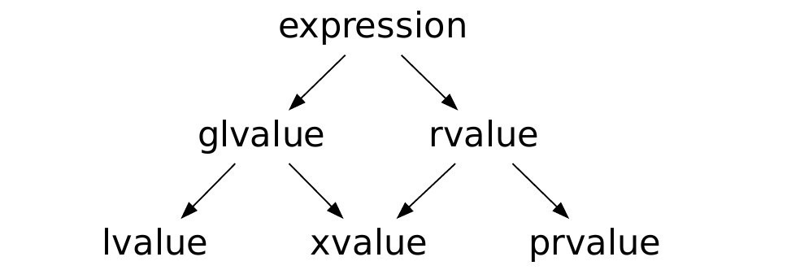

# 第四章 表达式

## 表达式基础

### 引入

- 表达式由一到多个操作数组成，可以求值并（通常会）返回求值结果
  - 最基本的表达式：变量、字面值
  - 通常而言，表达式会包含操作符（运算符）
  - 操作符的特性
    - 接收几个操作数：一元、二元、三元
    - 操作数的类型——类型转换
    - 操作数是左值还是右值
    - 结果的类型
    - 结果是左值还是右值
    - 优先级与结合性（cpp-reference），可以通过小括号来改变运算顺序
    - 操作符的重载——不改变接收操作数的个数、优先级与结合性
  - 操作数求值顺序的不确定性
  
  ```c++
  // 一种不安全的应用
  #include <iostream>
  void fun (int p1, int p2)
  {
      std::cout << p1 << ' ' << p2 << std::endl;
  }
  
  int main()
  {
      int x =0;
      fun(x = x + 1, x = x + 1); // WARNING!!
      // 结果取决于编译器，C++未进行相应规定
      return 0;
  }
  ```

### 左值与右值

- 传统左值与右值的划分

  - 来源于C语言：左值可能放在等号左边；右值只能放在等号右边
  - 在C++中，左值也不一定能放在等号左边；右值也可能放在等号左边

  ```c++
  const int x = 4;
  x = 3;  // x是左值但是不能放在等号左边
  ```

  ```c++
  struct Str{};
  
  int main()
  {
      Str() = Str();   // Str()是右值但是也可以放在等号左边
  }
  ```

  

- 所有的划分都是针对表达式的，不是针对对象或数值

  - `glvalue`：标识一个对象、位或函数——>泛左值：表达式求值可确定一个对象、位域或函数的个体
  - `prvalue`：用于初始化对象或作为操作数——>纯右值：计算某个运算符的操作数的值，或void表达式，或初始化某个对象位域
  - `xvalue`：表示其资源可以被重新利用——>亡值(expiring)，参考右值引用

  

- 左值与右值的转换
  - 左值转换为右值（lvalue to rvalue conversion）
  - 临时具体化（Temporary Materialization）：`prvalue` -> `xvalue`
  
- 再论`decltype`
  - `prvalue` -> `type`
  - `lvalue` -> `type&`
  - `xvalue` -> `type&&` -> 右值引用

### 类型转换

- 一些操作符要求其操作数具有特定的类型，或者具有相同的类型，此时可能产生类型转换

- 隐式类型转换

  - 自动发生

  - 实际上是一个（有限长度）转型序列

    - [https://en.cppreference.com/w/cpp/language/implicit_conversion](https://en.cppreference.com/w/cpp/language/implicit_conversion)

    - 隐式转换序列：

      - 左值到右值的转换、数组到指针的转换及函数到指针的转换；
      - 数值提升或数值转换；

      ——>整型提升&浮点提升

      ——>数值转换：可以类型转换，潜在精度损失

      - 函数指针转换；——> C++17
      - 限定转换；

- 显式类型转换
  - 显式引入的转换
  - `static_cast`：转换在编译期完成，不会对程序运行期性能产生影响；
  
  ```c++
  // 3 + 0.5;
  static_cast<double>(3) + 0.5;
  ```
  
  ```c++
  int main()
  {
      int x = 3;
      int y = 4;
      std::cout << (x / static_cast<double>(y)) << std::endl;
  }
  ```
  
  - `const_cast`：会改变变量的常量性；
  
  ```c++
  const int* ptr;
  const_cast<int*>(ptr);
  ```
  
  但需要注意的是`const_cast`这种操作很危险：
  
  ```c++
  const int x = 3;
  const int& ref = x;
  int& ref2 = const_cast<int&>(ref);
  ref2 = 4;
  
  std::cout << x << std::endl;        // x = 3
  ```
  
  - `dynamic_cast`：运行期执行——>类；使用更为安全但性能较差；
  - `reinterpret_cast`:
  
  ```c++
  int x = 3;
  int* ptr = &x;
  double* ptr2 = reinterpret_cast<double*>(ptr);
  ```
  
  - C形式的类型转换 ——> explicit type conversion


## 表达式详述

### 算术操作符

- 共分为三个优先级
  - `+`, `-`（一元）
  - `*`, `/`, `%`
  - `+`, `-`（二元）
- 均为左结合的
- 通常来说，操作数与结果均为算术类型的右值；但加减法与一元`+`可接收指针
- 一元`+`操作符会产生integral promotion
- 整数相除会产生整数，向0取整
- 求余只能接收整数类型操作数，结果符号与第一个操作数相同
- 满足`(m/n)*n+m%n==m`

### 逻辑与关系操作符

- 关系操作符接收算术或指针类型操作数；逻辑操作符接收可转换为`bool`值的操作数
- 操作数与结果均为右值（结果类型为`bool`）
- 除逻辑非外，其他操作符都是左结合的
- 逻辑与、逻辑或具有短路特性

```c++
#include <iostream>

int main ()
{
    int* ptr = nullptr;
    if (ptr && (*ptr == 3)) 
    {
        // 注：尽管对空指针赋值是不合法的，但是此处由于逻辑与的短路特性直接由ptr指向空指针判断
        //          ptr && (*ptr == 3)返回FALSE
    }
}
```

- *逻辑与的优先级高于逻辑或*

- 通常来说，不能将多个关系操作符串联

- 不要写出 `val == true` 这样的代码

- Spaceship operator: `<=>`（C++20引入）

  ```c++
  auto res = (a <=> b);
  ```

  - `strong_ordering`
  - `weak_ordering`
  - `partial_ordering`

### 位操作符

- 接收右值，进行位运算，返回右值
- 除取反外，其他运算符均为左结合的
- 注意计算过程中可能会涉及到integral promotion
- *注意位操作符没有短路逻辑*
- 移位操作在一定情况下等价于乘（除）2的幂，但速度更快

```c++
int x = 3;
constexpr int y = 2;
// 以下两个表达式等价
std::cout << (x << 1) << std::endl;
std::cout << (x * y) << std::endl;
```

- 注意整数的符号与位操作符的相关影响
  - integral promotion会根据整数的符号影响其结果

  ```c++
  unsigned char x = 0xff;   // 11111111
  // 000...0011111111
  // y = 111...1100000000
  signed char z = 0xff; // 11111111
  // 111...1111111111
  // m = 000...0000000000
  auto y = ~x;
  auto m = ~z;
  std::cout << y << std::endl; // y = -256
  std::cout << z << std::endl; // y = 0
  ```

  - 右移保持符号，但左移不能保证

### 赋值操作符

- 左操作数为可修改左值；右操作数为右值，可以转换为左操作数的类型

  ```c++
  struct Str { };
  int main ()
  {
      int x;
      x = Str(); // ERROR：Str()不能转换成左操作数
  }
  ```
- 赋值操作数是右结合的

  ```c++
  x = y = 3;
  x = 5 = 2; // ERROR：5 = 2不合法（5不能为左值）
  ```
- 求值结果为左操作数
- 可以引入大括号（初始化列表）以防止收缩转换（narrowing conversion）

```c++
short x;
x = { 0x80000003 };
```

- 小心区分`=`与`==`
- 复合赋值运算符

### 自增与自减运算符

- `++`；`--`
- 分前缀和后缀两种情况
- 操作数为左值；前缀(`++i`)时返回左值；后缀(`i++`)时返回右值

  - 后缀自增将返回原始值，前缀自增将返回运算后的值。

  ```c++
  int x = 0;
  ++x; // x = 1
  x++; // x = 1
  ```

  ```c++
  #include <iostream>
  
  int main()
  {
      int x =0;
  
      std::cout << x++ << std::endl;   // 0
      std::cout << ++x << std::endl;   // 2
  
      return 0;
  }
  ```

  - 建议使用前缀形式(`++i`)

### 其他操作符

- 成员访问操作符：`.`与`->`

  ```c++
  #include <iostream>
  struct Str
  {
      int x;
  };
  
  int main()
  {
      Str a;
      a.x;
      
      Str* ptr = &a;
      (*ptr).x;
  }
  ```

  - `->`等价于`(*).`
  - `.`的左操作数是左值（或右值），返回左值（或右值`xvalue`）
  - `->`的左操作数指针，返回左值

- 条件操作符
  - 唯一的三元操作符
  - 接收一个可转换为`bool`的表达式与*两个类型相同的表达式*，只有一个表达式会被求值
  - 如果表达式均是左值，那么就返回左值，否则返回右值
  - 右结合
  
- 逗号操作符
  
  ```c++
  std::out << (2, )
  ```
  
  - 确保操作数会被从左向右求值
  - 求值结果为右操作数
  - 左结合
  
- `sizeof`操作符
  - 操作数可以是一个类型或一个表达式
  - 并不会实际求值，而是返回相应的尺寸
  
- 其他操作符
  - 域解析操作符`::`
  - 函数调用操作符`()`
  - 索引操作符`[]`
  - 抛出异常操作符`throw`
  - ...

## C++17对表达式的求值顺序限定

- 以下表达式在C++17中，可以确保e1会优先于e2被求职
  - `e1[e2]`
  - `e1.e2`
  - `e2.*e2`
  - `e1->*e2`
  - `e1<<e2`
  - `e1>>e2`
  - `e2 = e1`/`e2 += e1`/`e2 *= e1`... （赋值以及赋值相关的复合运算）
- `new Type(e)`会确保`e`会在分配内存之后求值
