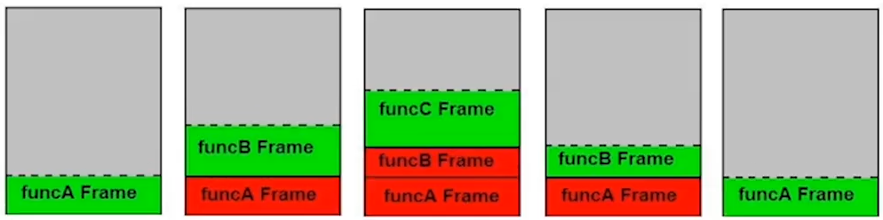
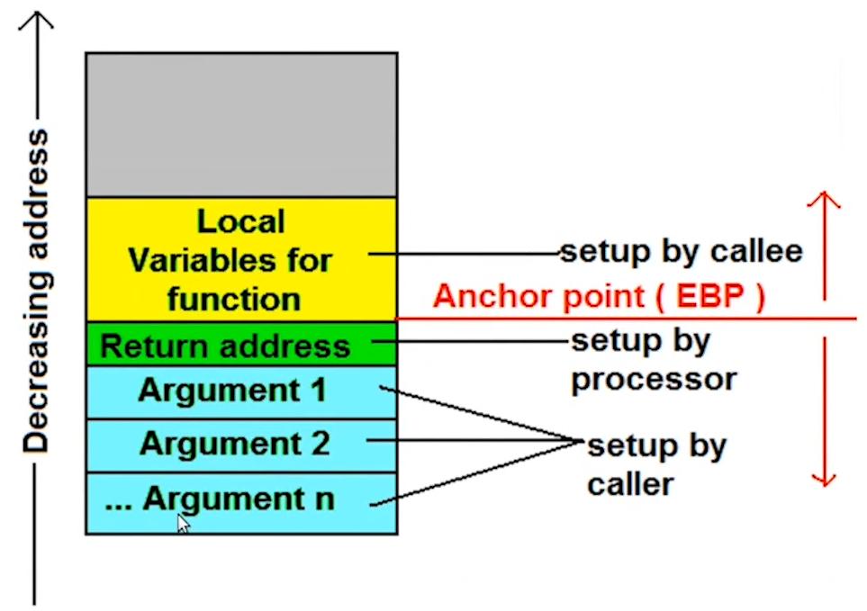

# 第六章 函数

## 函数基础

- 函数：封装了一段代码，可以在一次执行过程中被反复调用。
  - 函数头
    - 函数名称——标识符，用于后续的调用
    - 形式参数——代表函数的输入参数
    - 返回类型——函数执行完成后所返回的结果类型
  - 函数体
    - 为一个语句块（block），包含了具体的计算逻辑
- 函数声明与定义
  - 函数声明只包含函数头，不包含函数体，通常至于头文件中
  - 函数声明可出现多次，但函数定义通常只能出现一次（存在例外）
- 函数调用
  - 需要提供函数名与实际参数
  - 实际参数拷贝初始化形式参数
    - argument——>实参
    - parameter——>形参
  - 返回值会被拷贝给函数的调用者
  - 栈帧结构
    - Frame（帧），每一个function按栈帧在memory中堆放，先入后出；

```c++
int Add(int x, int y)
{
    int x1 = x + 1; // 局部变量
    return x + y;
}

int Sub(int x, int y)
{
    return x - y;
}

int main()
{
    int z = Add(2, 3);
    std::cout << z << std::endl;
    
    z = Sub(2, 3);
    std::cout << z << std::endl;
}
```





- 拷贝过程的（强制）省略
  - 返回值优化
  - C++17强制省略拷贝临时对象
- 函数的外部链接——mangle&demangle

```c++
// ---------------------------------------------------------------------------------------------------------
extern "C"
int Add(int x, int y)
{
    return x + y;
}
```

## 函数详解

### 参数

- 函数可以在函数头的小括号中包含零到多个形参
  - 包含零个形参时，可以使用void标记
  
  - 对于非模板函数来说，其每个形参都有确定的类型，但形参可以没有名称
  
  - 形参名称的变化并不会引入函数的不同版本
  
  - 实参到形参的<u>拷贝求值顺序不定</u>，C++17强制<u>忽略复制临时对象</u>
    
    ```c++
    #include <iostream>
    
    void fun(int x, int y)
    {
        std::cout << y;
    }
    
    int main()
    {
        fun(1, 2);       // 拷贝求值顺序不定
        fun(1, int{});   // 临时变量会被C++17标准强制忽略，C++17标准之前由编译器决定
    }
    ```
    
    - `-fno-elide-constructors`忽略C++11（C++17标准之前）中对复制临时对象强制忽略的约束
  
- 函数传值、传址、传引用

  ```c++
  #include <iostream>
  
  void fun(int par)
  {
      ++par;
  }
  
  int main()
  {
      int arg = 3;
      fun(arg);
      std::cout << arg << '\n';   // 传值
  }
  ```

  ```c++
  #include <iostream>
  
  void fun(int* par)
  {
      ++(*par);
  }
  
  int main()
  {
      int arg = 3;
      fun(&arg);
      std::cout << arg << '\n';   // 传址
  }
  ```

  ```c++
  #include <iostream>
  
  void fun(int& par)
  {
      ++par;
  }
  
  int main()
  {
      int arg = 3;
      fun(arg);
      std::cout << arg << '\n';   // 传引用
  }
  ```

- 函数传参过程中的类型退化

  ```c++
  #include <iostream>
  
  void fun(int par[])   // void fun(int* par)
  {
      // ...
  }
  
  int main()
  {
      int a[3];
      fun(a);
  }
  ```

- 变长参数
  - `initializer_list`
  
    ```c++
    #include <iostream>
    #include <initializer_list>
    
    void fun(std::initializer_list<int> par)
    {
        // ...
    }
    
    int main()
    {
        fun({1, 2, 3, 4, 5});      // right
        fun({1, 2, 3, "123", 5});  // wrong
    }
    ```
  
  - 可变长度模板参数
  
  - 使用省略号表示形式参数
  
- 函数可以定义缺省实参
  - 如果某个形参具有缺省实参，那么它右侧的形参都必须具有缺省实参
  - 在一个翻译单元中，每个形参的缺省实参只能定义一次
  - 具有缺省实参的函数调用时，传入的缺省值会随对象值的变化而变化
  
- `main`函数的两个版本
  - 无形参版本
  - 带两个形参的版本

### 函数体

- 函数体形成域
  - 其中包含了自动对象（内部声明的对象以及形参对象）
  - 也可包含局部静态对象
- 函数体执行完成时的返回
  - 隐式返回
  - 显式返回关键字：`return`
    - `return;`语句
    - `return 表达式;`
    - return 初始化列表;
  - 小心返回自动对象的引用或指针
  - 返回值优化（RVO）——C++17对返回临时对象的强制优化‘

### 返回类型

- 返回类型表示了函数计算结果的类型，可以为void
- 返回类型的几种书写方法
  - 经典方法：位于函数头的前部
  - C++11引入的方式：位于函数头的后部
  - C++14引入的方式：返回类型的自动推导
    - 使用`constexpr if`构造“具有不同返回类型”的函数
- 返回类型与结构化绑定（C++17）
- `[[nodiscard]]`属性（C++17）

## 函数重载与重载解析

- 函数重载：使用相同的函数名定义多个函数，每个函数具有不同的参数列表

  - 不能基于不同的返回类型进行重载

- 编译器如何选择正确的版本完成函数调用？

  - 参考资源：Calling Functions: A Tutorial

- 名称查找

  - 限定查找（qualified lookup）与非限定查找（unqualified lookup）
  - 非限定查找会进行域的逐级查找——名称隐藏（hiding）
  - 查找通常只会在已声明的名称集合中进行
  - 实参依赖查找（Argument Dependent Lookup: ADL）
    - 只对自定义类型生效

- 重载解析：在名称查找的基础上进一步选择合适的调用函数

  - 过滤不能被调用的版本（non-viable candidates）
    - 参数个数不对
    - 无法将实参转换为形参
    - 实参不满足形参的限制条件
  - 在剩余版本中查找与调用表达式最匹配的版本，匹配级别越低越好（有特殊规则）
    - 级别1：<u>完美匹配</u> 或 <u>平凡转换（比如加一个`const`）</u>
    - 级别2：<u>promotion</u> 或 <u>promotion加平凡转换</u>
    - 级别3：<u>标准转换</u> 或 <u>标准转换加平凡转换</u>
    - 级别4*：<u>自定义转换</u> 或 <u>自定义转换加平凡转换</u> 或 <u>自定义转换加标准转换</u>
    - 级别5*：<u>形参为省略号的版本</u>
    - 函数包含多个形参时，所选函数的所有形参的匹配级别都要优于或等于其他函数

  

## 函数相关的其他内容

- 递归函数：在函数体中调用其自身的函数
  - 通常用于描述复杂的迭代过程（示例）
- 内联函数/`constexpr`函数（C++11起）/`consteval`函数（C++20起）
- 函数指针
  - 函数类型与函数指针类型
  - 函数指针与重载
  - 将函数指针作为函数参数
  - 将函数指针作为函数返回值
  - 小心：Most vexing parse