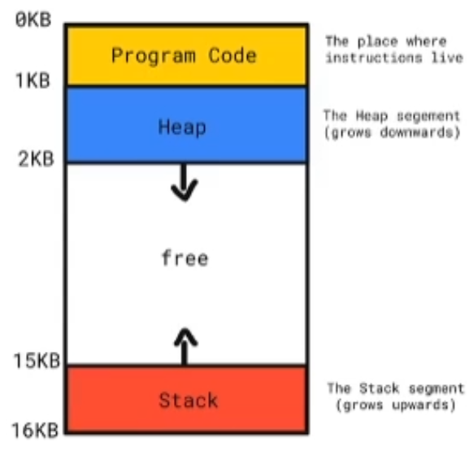

# 第12章 动态内存

- 对象的生命周期
  - 全局对象：程序启动时分配，程序结束时销毁
  - 局部自动对象：在进入定义的程序块时创建，离开该程序块时销毁
  - 局部static对象：第一次使用前分配，程序结束时销毁
- 内存
  - 静态内存：保存局部static对象、类static数据成员以及定义在任何函数*之外*的变量
  - 栈内存：保存定义在函数*内*的非static对象
    - 分配在静态内存或栈内存中的对象由编译器自动创建和销毁
  - 内存池（自由空间free store 和 堆heap）

## 1. 动态内存基础

- 栈内存 V.S. 堆内存
  - 栈（后进先出）内存的特点：更好的局部性，对象编译器自动销毁——> Stack
  - 堆内存的特点：运行期动态扩展，需要显式释放——> Heap



- 在C++中通常使用`new`与`delete`来构造、销毁对象

  ```c++
  #include <iostream>
  
  int main()
  {
      int* y = new int(2);
      std::cout << *y << std::endl;
      // ...
      delete y;
  }
  ```

  ```c++
  #include <iostream>
  
  int* fun()
  {
      int* res1 = new int(2);       // 使用堆内存
      // int res2 = 2;              // 使用栈内存
      return res1;
      // return res2;
  }
  int main()
  {
      int* y = new int(2);
      // int* y = fun();            // 注意此处使用栈内存，指针指向临时变量，是一种很危险的用法
      std::cout << *y << std::endl;
      // ...
      delete y;
  }
  ```

- 对象的构造分成两步：<u>分配内存与在所分配的内存上构造对象；对象的销毁与之类似，销毁给定的指针指向的对象并释放对应的内存。</u>

- `new`的几种常见形式
  
  - 构造单一对象/对象数组
  
    ```c++
    #include <iostream>
    
    int main()
    {
        int* y = new int[5]; // 该代码连续开辟了20字节(1 int = 4 bytes)
                             // 这5个int进行缺省初始化
                             // 该代码将连续的20个byte的首地址返回并存在y中
                             // 或将5个int的首地址返回并存在y中
        int* x = new int[5]{1, 2, 3, 4, 5}; // 初始化
        std::cout << x[2] << std::endl;
        delete[] x; // 删除x
    }
    ```
  
  - `nothrow new` ——> 避免抛出异常
  
    默认情况下，如果`new`不能分配所要求的内存空间，它会抛出一个类型为`bad_alloc`的异常，可以通过改变使用`new`的方式来阻止它抛出异常。
  
    ```c++
    #include <iostream>
    #include <new>
    
    int main()
    {
        // int* y = new int[5]{};   // new 会自动抛出异常
        // 如需要对异常进行讨论则应该使用 std::nothrow 避免抛出异常
        int* y = new(std::nothrow) int[5]{};
        if (y == nullptr)
        {
            // 若存在异常则处理if语句块
        }
        std::cout << y[2] << std::endl;
    
        delete[] y;
    }
    ```
  
  - `placement new`
  
    ```c++
    #include <iostream>
    #include <new>
    
    int main()
    {
        // placement new
        char ch[sizeof(int)];
        int* y = new (ch) int(4);   // 在ch地址上构造了y
        std::cout << *y << std::endl;
    }
    ```
  
  - `new auto`
  
    ```c++
    int* y = new auto(3);
    ```
  
- `new`与对象对齐

  ```c++
  #include <iostream>
  #include <new>
  
  struct alignas(1024) Str{}; // 对齐地址为1024的整数倍
  int main()
  {
      Str* ptr = new Str();
      std::cout << ptr << std::endl;
  }
  ```

- `delete`的常见用法
  
  - 销毁单一对象/数组
  
  - `placement delete` ——> 只销毁而不归还内存给系统
  
    ```c++
    #include <iostream>
    #include <new>
    
    struct Str
    {
        // 析构函数(destructor)
        ~Str()
        {
            std::cout << "~Str is called" << std::endl;
        }
    };
    
    int main()
    {
        // placement delete
        char ch[sizeof(Str)];
        Str* ptr = new (ch) Str;
        ptr -> ~Str();
    }
    
    ```
  
- 使用`new`与`delete`的注意事项
  - 根据分配的是单一对象还是数组，采用相应的方式销毁
  
  - `delete nullptr` ——> 此时仍能正常编译，`delete`不进行操作
  
  - 不能`delete`一个非`new`返回的内存
  
    ```c++
    #include <iostream>
    #include <new>
    
    int main()
    {
        int* ptr = new int[5];   // new返回的内存
        int* ptr2 = (ptr + 1);   // 非new返回的内存
        delete[] ptr2;
    }
    ```
  
  - 同一块内存不能`delete`多次
  
- 调用系统自身的`new`/`delete`行为
  - <u>*不要轻易使用*</u>

- `const`对象的动态分配与删除：类似于其他任何`const`对象，一个动态分配的`const`对象必须进行初始化；同时虽然一个`const`对象的值不能被改变，但他本身是可以被销毁的，只要`delete`指向他的指针即可。

  ```c++
  const int* pci = new const int(1024);
  delete pci;
  ```

## 2. 智能指针

- 使用`new`与`delete`的问题：内存所有权不清晰，容易产生不销毁、多销毁的情况

- C++的解决方案：智能指针——> `#include <memory>`
  - `auto_ptr`（C++17删除）
  - `shared_ptr`/`unique_ptr`/`weak_ptr`
  
- `shared_ptr`——基于*引用计数*的共享内存解决方案
  
  ```c++
  #include <iostream>
  #include <new>
  #include <memory>
  
  int main()
  {
      // int* x(new int(3));
      std::shared_ptr<int> x(new int(3));
      std::cout << x.use_count() << std::endl;
      {
          std::shared_ptr<int> y = x;
          std::cout << y.use_count() << std::endl;
      }
      std::cout << x.use_count() << std::endl;
  }
  ```
  
  - 基本用法
  
  - `reset`/`get`方法
  
    ```c++
    #include <iostream>
    #include <new>
    #include <memory>
    
    std::shared_ptr<int> fun()
    {
        std::shared_ptr<int> res(new int(100));
        return res;
    }
    
    int main()
    {
        auto y = fun();
        std::cout << *(y.get()) << std::endl;   // 100
        y.reset(new int(3));
        std::cout << *(y.get()) << std::endl;   // 3
        
        
        // y.reset((int*)nullptr)
        y.reset();
    }
    ```
  
  - 指定内存回收逻辑
  
    ```c++
    #include <iostream>
    #include <new>
    #include <memory>
    
    void fun(int* ptr)
    {
        std::cout << "fun is called" << std::endl;
        delete ptr;
    }
    
    int main()
    {
        std::shared_ptr<int> x(new int(3), fun); // fun -> deleter d
    }
    ```
  
    ```c++
    #include <iostream>
    #include <new>
    #include <memory>
    
    void dummy(int*) {}
    
    std::shared_ptr<int> fun()
    {
        static int res = 3;
        return std::shared_ptr<int> (&res, dummy); // 自定义内存回收逻辑
    }
    
    int main()
    {
        auto y = fun();
    }
    ```
  
  - `std::make_shared`
  
  - 支持数组（C++17支持`shared_ptr<T[]>`；C++20支持`make_shared`分配数组）
  
  - 注意：`shared_ptr`管理的对象不要调用`delete`销毁
  
- `unique_ptr`——独占内存的解决方案
  
  - 基本用法
  
    ```c++
    #include <iostream>
    #include <new>
    #include <memory>
    
    int main()
    {
        std::unique_ptr<int> x(new int(3));
        std::cout << x.get() << std::endl; // 将亡值
        std::unique_ptr<int> y = std::move(x); // unique_ptr移动
        std::cout << x.get() << std::endl; // 0
        std::cout << y.get() << std::endl;
    }
    ```
  
  - `unique_ptr`不支持复制，但可以移动
  
  - 为`unique_ptr`指定内存回收逻辑
  
    ```c++
    #include <iostream>
    #include <new>
    #include <memory>
    
    std::unique_ptr<int> fun()
    {
        auto res = std::make_unique<int> (3);
        return res;
    }
    
    int main()
    {
        std::unique_ptr<int> x = fun();
    }
    ```
  
    ```c++
    #include <iostream>
    #include <new>
    #include <memory>
    
    void fun(int* ptr)
    {
        std::cout << "fun is called\n";
        delete ptr;
    }
    
    int main()
    {
        std::unique_ptr<int, decltype(&fun)> x(new int(3), fun);
    }
    ```
  
- `weak_ptr`——防止循环引用而引入的智能指针
  
  ```c++
  #include <iostream>
  #include <new>
  #include <memory>
  
  struct Str
  {
      std::shared_ptr<Str> m_nei;
  
      ~Str()
      {
          // 析构函数
          std::cout << "~Str() is called\n";
      }
  };
  
  int main()
  {
      // 循环引用案例
      std::shared_ptr<Str> x(new Str{});   // [x] = 1 -> 引用计数
      std::shared_ptr<Str> y(new Str{});   // [y] = 1
      x -> m_nei = y;   // [y] = 2
      y -> m_nei = x;   // [x] = 2
      
      // 引用计数不为零，程序运行完毕不会调用销毁
  }
  ```
  
  ```c++
  #include <iostream>
  #include <new>
  #include <memory>
  
  struct Str
  {
      std::weak_ptr<Str> m_nei;   // weak_ptr
  
      ~Str()
      {
          std::cout << "~Str() is called\n";
      }
  };
  
  int main()
  {
      std::shared_ptr<Str> x(new Str{});   // [x] = 1 -> 引用计数
      std::shared_ptr<Str> y(new Str{});   // [y] = 1
      x -> m_nei = y;   // [y] = 2
      y -> m_nei = x;   // [x] = 2
  
      // 引用计数不为零，程序运行完毕不会调用销毁
  }
  ```
  
  - 基于`shared_ptr`构造
  
    - 不会增加引用计数值
  
  - `lock`方法
  
    - `expired() ? shared_ptr<T>() : shared_ptr<T>(*this)`
  
      ```c++
      #include <iostream>
      #include <new>
      #include <memory>
      
      struct Str
      {
          std::weak_ptr<Str> m_nei;
      
          ~Str()
          {
              std::cout << "~Str() is called\n";
          }
      };
      
      int main()
      {
          std::shared_ptr<Str> x(new Str{});   // [x] = 1 -> 引用计数
          std::shared_ptr<Str> y(new Str{});   // [y] = 1
          x -> m_nei = y;   // [y] = 2
          y -> m_nei = x;   // [x] = 2
      
          // 引用计数不为零，程序运行完毕不会调用销毁
      
          if (auto ptr = x -> m_nei.lock(); ptr)
          {
              std::cout << "Can access pointer\n";
          }
          else
          {
              std::cout << "Cannot access pointer\n";
          }
      }
      ```

## 3. 动态内存的相关问题

- `sizeof`不会返回动态分配的内存大小
- 使用分配器（`allocator`）来分配内存
- 使用`malloc`/`free`来管理内存
- 使用`aligned_alloc`来分配对齐内存
- 动态内存与异常安全
- C++对于垃圾回收的支持

