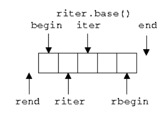

# 第10章 泛型算法

## 1. 泛型算法

- 泛型算法：可以支持多种类型的算法

  - 这里重点讨论C++标准库中定义的算法
    - `<algorithm><numeric><ranges>`
  - 为什么要引入泛型算法而不采用方法的形式
    - 内建数据类型不支持方法
    - 计算逻辑存在相似性，避免重复定义
  - 如何实现支持多种类型：使用迭代器作为算法与数据的桥梁

- 泛型算法通常来说并不复杂，但优化足够好

- 一些泛型算法与方法同名，实现功能类似，此时建议调用方法而非算法

  - `std::find` V.S. `std::map::find`

- 泛型算法的分类

  - 读算法：给定迭代区间，读取其中的元素并进行计算
    - `accumulate`/`find`/`count`
  - 写算法：向一个迭代区间中写入元素
    - 单纯写操作：`fill`/`fill_n`
    - 读+写操作：`transpose`/`copy`
    - 注意：写算法一定要保证目标区间足够大
  - 排序算法：改变输入序列中元素的顺序
    - `sort`/`unique`

- 泛型算法使用迭代器实现元素访问

- 迭代器的分类

  - 输入迭代器：可读，可递增——典型应用为`find`算法
  - 输出迭代器：可写，可递增——典型应用为`copy`算法
  - 前向迭代器：可读写，可递增——典型应用为`replace`算法
  - 双向迭代器：可读写，可递增递减——典型应用为`reverse`算法
  - 随机访问迭代器：可读写，可递增一个整数——典型应用为`sort`算法

- 一些算法会根据迭代器类型的不同引入相应的优化：如`distance`算法

- 一些特殊的迭代器

  - 插入迭代器：`back_inset_iterator`/`front_insert_iterator`/`insert_iterator`

  - 流迭代器：`istream_iterator`/`ostream_iterator`

  - 反向迭代器

    

  - 移动迭代器：`move_iterator`

- 迭代器与哨兵（Sentinel）

- 并发计算（C++17/C++20）

  - `std::execution::seq`
  - `std::execution::par`
  - `std::execution::par_unseq`
  - `std::execution::unseq`

## 2. `bind`与`lambda`表达式

### `bind`与`lambda`表达式

- 很多算法允许通过可调用对象自定义计算逻辑的细节
  - `transform`/`copy_if`/`sort`...
- 如何定义可调用对象
  - 函数指针：概念直观，但定义位置受限
  - 类：功能强大，但书写麻烦
  - `bind`：基于已有的逻辑灵活适配，但描述复杂逻辑时语法可能会比较复杂难懂
  - `lambda`表达式：小巧灵活，功能强大

### `bind`

- 早期的`bind`雏形：`std::bind1st`/`std::bind2nd`
  - 具有了`bind`的基本思想，但功能有限
- `std::bind`（C++11引入）：用于修改可调用对象的调用方式
  - 调用`std::bind`时，传入的参数会被复制，这可能会产生一些调用风险
  - 可以使用`std::ref`或`std::cref`避免复制的行为
- `std::bind_front`（C++20引入）：`std::bind`的简化形式

### `lambda`表达式

- `lambda`表达式（[https://leanpub.com/cpplambda](https://leanpub.com/cpplambda)）
  - 为了更灵活地实现可调用对象而引入
  - C++11~C++20持续更新
    - C++11引入`lambda`表达式
    - C++14支持初始化捕获、泛型`lambda`
    - C++17引入`constexpr lambda`，`*this`捕获
    - C++20引入`concepts`，模板`lambda`
- `lambda`表达式会被编译器翻译成类进行处理
- `lambda`表达式的基本组成部分
  - 参数与函数体
  - 返回类型
  - 捕获：针对函数体中使用的局部自动对象进行捕获
    - 值捕获、引用捕获与混合捕获
    - `this`捕获
    - 初始化捕获（C++14）
    - `*this`捕获（C++17）
  - 说明符
    - `mutable`/`constexpr`(C++17)/`consteval`(C++20)...
  - 模板形参（C++20）
- `lambda`表达式的深入应用
  - 即调用函数表达式（Immediately-Invoked Function Expression, IIFE）
  - 捕获时计算（C++14）
  - 使用`auto`避免复制（C++14）
  - `Lifting`（C++14）
  - 递归调用（C++14）

## 3. 泛型算法的改进——`ranges`

- 可以使用容器而非迭代器作为出入
  - 通过`std::ranges::dangling`避免返回无效的迭代器
- 从类型上区分迭代器与哨兵
- 引入映射概念，简化代码编写
- 引入`view`，灵活组织程序逻辑