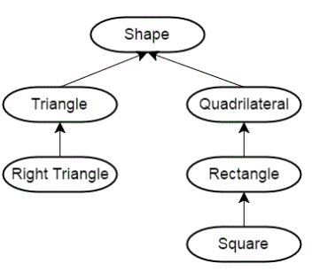
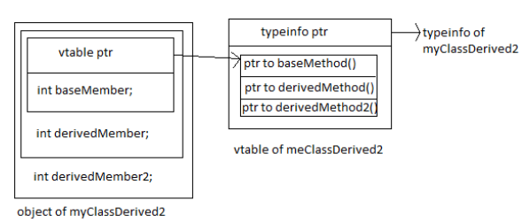

# 第12章：类的进阶

## 1. 运算符重载

- 使用`operator`关键字引入重载函数
  - 重载不能发明新的运算，不能改变运算的优先级与结合性，通常不改变运算的含义
  - 函数参数个数与运算操作符个数相同，至少一个为类类型
  - 除`operator()`外其他运算符不能有缺省参数
  - 可以选择实现为成员函数与非成员函数
    - 通常来说，实现为成员函数会以`*this`作为第一个操作数（注意`==`域`<=>`的重载）
- 根据重载特性，可以将运算符进一步划分（[参考资料](https://en.cppreference.com/w/cpp/language/operators)）：
  - 可重载且必须实现为成员函数的运算符（`=`, `[]`, `()`, `->`与转型运算符）
  - 可重载且可实现为非成员函数的运算符
  - 可重载但不建议重载的运算符（`&&`, `||`, 逗号运算符）
    - C++17中规定了相应的求值顺序但没有方式实现短路逻辑
  - 不可重载的运算符（如`?` `:`运算符）

### 运算符重载详述

- 对称运算符通常定义为非成员函数以支持首个操作数的类型转换
- 移位运算符一定要定义为非成员函数，因为其首个操作数类型为流类型
- 赋值运算符也可以接收一般参数
- `operator[]`通常返回引用
- 自增、自减运算符的前缀、后缀重载方法
- 使用解引用运算符(`*`)与成员访问运算符(`->`)模拟指针行为
  - 注意“`.`”运算符不能重载
  - “`->`”会递归调用“`->`”操作
- 使用函数调用运算符构造可调用对象
- 类型转换运算符
  - 函数声明为`operator type() const`
  - 与单参数构造函数一样，都引入了一种类型转换方式
  - 注意避免引入歧义性与意料之外的行为
    - 通过`explicit`引入显式类型转换
  - `explicit bool`的特殊性：用于条件表达式时会进行隐式类型转换
- C++20中对`==`于`<=>`的重载
  - 通过`==`定义`!=`
  - 通过`<=>`定义多种比较逻辑
  - 隐式交换操作数
  - 注意`<=>`可返回的类型：`strong_ordering`, `weak_ordering`, `partial_ordering`

## 2. 类的继承

- 通过类的继承（派生）来引入“是一个”的关系（[参考图片来源](https://www.learncpp.com/cpp-tutorial/basic-inheritance-in-c/)）
  - 通常采用`public`继承（`struct` V.S. `class`）
  - 注意：继承部分不是类的声明
  - 使用基类的指针或引用可以指向派生类对象
  - 静态类型 V.S. 动态类型
  - `protected`限定符：派生类可访问
- 类的派生会形成
  - 派生类所在域位于基类内部
  - 派生类中的名称定义会覆盖基类
  - 使用域操作符显式访问基类成员
  - 在派生类中调用基类的构造函数

### 虚函数

- 通过虚函数与引用（指针）实现动态绑定
  - 使用关键字`virtual`引入
  - 非静态、非构造函数可声明为虚函数
  - 虚函数会引入[`vtable`结构](https://www.avabodh.com/cxxin/multivirtual.html)
    - `dynamic_cast`
- 虚函数在基类中的定义
  - 引入缺省逻辑
  - 可以通过`=0`声明纯虚函数，相应地构造抽象基类
- 虚函数在派生类中的重写（`override`）
  - 函数签名保持不变（返回类型可以是原始返回指针/引用类型的派生指针/引用类型）
  - 虚函数特性保持不变
  - `override`关键字
- 由虚函数所引入的动态绑定属于运行期行为，与编译期行为有所区别
  - 虚函数的缺省实参只会考虑静态类型
  - 虚函数的调用成本高于非虚函数
    - `final`关键字
  - 为什么要使用指针（或引用）引入动态绑定
  - 在构造函数中调用虚函数要小心
  - 派生类的析构函数会隐式调用基类的析构函数
  - 通常来说要将基类的析构函数声明为`virtual`的
  - 在派生类中修改虚函数的访问权限

### 集成与特殊成员函数

- 派生类合成的......
  - 缺省构造函数会隐式调用基类的缺省构造函数
  - 拷贝构造函数将隐式调用基类的拷贝构造函数
  - 赋值函数将隐式调用基类的赋值函数
- 派生类的析构函数会调用基类的析构函数
- 派生类的其它构造函数将隐式调用基类的缺省构造函数
- 所有的特殊成员函数在显式定义时都可能需要显式调用基类相关成员
- 构造与销毁顺序
  - 基类的构造函数会先调用，之后才涉及到派生类中数据成员的构造
  - 派生类中的数据成员会被先销毁，之后才涉及到基类的析构函数调用

### 补充知识

- `public`与`private`集成（[参考资料](https://www.programiz.com/cpp-programming/public-protected-private-inheritance)）
  - `public`继承：描述“是一个”的关系
  - `private`继承：描述“根据基类实现出”的关系
  - `protected`继承：几乎不会使用
- `using`与继承
  - 使用`using`改变基类成员的访问权限
    - 派生类可以访问该成员
    - 无法改变构造函数的访问权限
  - 使用`using`集成基类的构造函数逻辑
  - `using`与部分重写
- 继承与友元：友元关系无法继承，但基类的友元可以访问派生类中基类的相关成员
- 通过基类指针实现在容器中保存不同类型对象
- 多重继承与虚继承
- 空基类优化与[`[[no_unique_address]]`](https://en.cppreference.com/w/cpp/language/ebo)属性