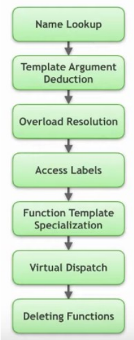

# 第16章 模板与泛型编程

## 函数模板

- 使用`template`关键字引入模板：`template<typename T> void fun(T) {...}`
  - 函数模板的声明与定义
  - `typename`关键字可以替换为class，含义相同
  - 函数模板中包含了两对参数：函数形参/实参；模板形参/实参
- 函数模板的显式实例化：`fun<int>(3)`
  - 实例化会使得编译器产生相应的函数（函数模板并非函数，不能调用）
  - 编译期的两阶段处理
    - 模板语法检查
    - 模板实例化
  - 模板必须在实例化时可见——翻译单元的一处定义原则
  - 注意与内联函数的异同
- 函数模板的重载
- 函数实参的类型推导（[参考文献](https://www.youtube.com/watch?v=wQxj20X-tIU )）
  - 如果函数模板在实例化时没有显式指定模板实参，那么系统会尝试进行推导
  - 推导是基于函数实参（表达式）确定模板实参的过程，其基本原则与`auto`类型推导相似
    - 函数形参是左值引用/指针：
      - 忽略表达式类型中的引用
      - 将表达式类型与函数形参模式匹配以确定模板实参
    - 函数形参是万能引用
      - 如果实参表达式是右值，那么模板形参被推导为去掉引用的基本类型
      - 如果实参表达式是左值，那么模板形参被推导为左值引用，触发引用折叠
    - 函数形参不包含引用
      - 忽略表达式类型中的引用
      - 忽略顶层`const`
      - 数组、函数转换成相应的指针类型
- 模板实参并非总是能够推导得到
  - 如果模板形参与函数形参无关，则无法推导
  - 即使相关，也不一定能进行推导，推导成功也可能存在因歧义而无法使用
- 在无法推导时，编译器会选择使用缺省模板实参
  - 可以为任意位置的模板形参指定缺省模板实参——注意与函数缺省实参的区别
- 显式指定部分模板实参
  - 显式指定的模板实参必须从最左边开始，依次指定
  - 模板形参的声明顺序会影响调用的灵活性
- 函数模板制动推导时会遇到的几种情况
  - 函数形参无法匹配——SFINAE（替换失败并非错误）
  - 模板与非模板同时匹配，匹配等级相同，此时选择非模板的版本
  - 多个模板同时匹配，此时采用偏序关系确定选择最特殊的版本
- 函数模板的实例化控制
  - 显式实例化定义：`template void fun(int)` / `template void fun(int)`
  - 显式实例化声明：`extern template void fun(int)` / `extern template void fun(int)`
  - 注意一处定义原则
  - 注意实例化过程中的模板形参推导
- 函数模板的（完全）特化：`template<> void f(int)` / `template<> void f(int)`
  - 并不引入新的（同名）名称，只是为某个模板针对特定模板实参提供优化算法
  - 注意与重载的区别
  - 注意特化过程中的模板形参推导
- 避免使用函数模板的特化（[参考文献](https://www.youtube.com/watch?v=wQxj20X-tIU )）
  - 不参与重载解析，会产生反直觉的效果
  - 通常可以用重载代替
  - 一些不便于重载的情况：无法建立模板形参与函数形参的关联
    - 使用`if constexpr`解决
    - 引入“假”函数形参
    - 通过类模板特化解决

- （C++20）函数模板的简化形式：使用 `auto` 定义模板参数类型
  - 优势：书写便捷
  - 劣势：在函数内部需要间接获取参数参数类型信息

## 类模板与成员函数模板

- 使用 `template` 关键字引入模板： `template class B {…};`
  - 类模板的声明与定义——翻译单元的一处定义原则
  - 成员函数只有在调用时才会被实例化
  - 类内类模板名称的简写
  - 类模板成员函数的定义（类内、类外）
- 成员函数模板
  - 类的成员函数模板
  - 类模板的成员函数模板
- 友元函数（模板）
  - 可以声明一个函数模板为某个类（模板）的友元
  - C++11支持声明模板参数为友元
- 类模板的实例化（[cpp reference](https://en.cppreference.com/w/cpp/language/class_template)）
  - 与函数实例化很像
  - 可以实例化整个类，或者类中的某个成员函数
- 类模板的（完全）特化/部分特化（偏特化）
  - 特化版本与基础版本可以拥有完全不同的实现
- 类模板的实参推导（从C++17开始）
  - 用于构造函数的实参推导
  - 用户自定义的推导指引
  - 注意：引入实参推导并不意味着降低了类型限制！
  - C++17之前的解决方案：引入辅助模板函数

## `Concepts`

- 模板的问题：没有对模板参数引入相应的限制
  - 参数是否可以正常工作，通常需要阅读代码进行理解
  - 编译报错友好性较差(`vector<int&>`)
- （C++20）`Concepts`：编译期谓词，基于给定的输入，返回`true`或`false`
  - 与`constraints`（`require`从句）一起使用时限制模板参数
  - 通常置于表示模板形参的尖括号后面进行限制
- `Concept`的定义与使用
  - 包含一个模板参数的`Concept`
    - 使用`requires`从句
    - 直接替换`typename`
  - 包含多个模板参数`Concept`
    - 用做类型`constraint`时，少传递一个参数，推导出的类型将作为首个参数
- `require`表达式
  - 简单表达式：表明可以接收的操作
  - 类型表达式：表明是一个有效的类型
  - 复合表达式：表明操作的有效性，以及操作返回类型的特性
  - 嵌套表达式：包含其他的限定表达式
- 注意区分`requires`从句与`requires`表达式
- `requires`从句会影响重载解析与特化版本的选取
  - 只有`requires`从句有效而且返回为`true`时相应的模板才会被考虑
  - `requires`从句所引入的限定具有偏序特性，系统会选择限制最严格的版本
  - 特化小技巧：在声明中引入“`A||B`”进行限制，之后分别针对`A`与`B`引入特化

## 模板相关内容

### 别名模板与变长模板

- 可以使用`using`引入别名模板
  - 为目标本身引入别名
  - 为类模板的成员引入别名
  - 别名模板不支持特化，但可以基于类模板的特化引入别名，以实现类似特化的功能
    - 注意与实参推导的关系
- 变长模板(Variadic Template)
  - 变长模板参数与参数包
  - 变长模板参数可以是数值、类型或模板
  - `sizeof`...操作
  - 注意变长模板参数的位置

### 包展开与折叠表达式

- （C++11）通过包展开技术操作变长模板参数
  - 包展开语句可以很复杂，需要明确是哪一部分展开，在哪里展开
- （C++17）折叠表达式([cpp reference](https://en.cppreference.com/w/cpp/language/fold))
  - 基于逗号的折叠表达式应用
  - 折叠表达式用于表达式求值，无法处理输入（输出）是类型与模板的情形

### 完美转发与lambda表达式模板

- （C++11）完美转发：`std::forward`函数
  - 通常与万能引用结合使用
  - 同时处理传入参数是左值或右值的情形
- （C++20）[`lambda`表达式模板](https://en.cppreference.com/w/cpp/language/lambda)

### 消除歧义与变量模板

- 使用`typename`与`template`消除歧义
  - 使用`typename`表示一个依赖名称是类型而非静态数据成员
  - 使用`template`表示一个依赖名称是模板
  - `template`与成员函数模板调用
- （C++14）变量模板
  - `template<typename T> T pi = (T)3.1415926;`
  - 其他形式的变量模板