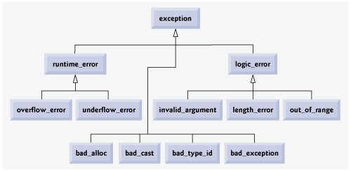

# 其他的工具与技术

## 1. 异常处理

- 用于处理程序在调用过程中的非正常行为

  - 传统的处理方式：传返回值表示函数调用是否正常结束
  - C++中的处理方法：通过关键字`try`/`catch`/`throw`引入异常处理机制

- 异常触发时的系统行为——栈展开

  - 抛出异常后续的代码不会被执行
  - 局部对象会按照构造相反的顺序自动销毁
  - 系统尝试匹配相应的`catch`代码段
    - 如果匹配则执行其中的逻辑，之后执行`catch`后续的代码
    - 如果不匹配则继续进行栈展开，直到“跳出”`main`函数，触发`terminate`结束运行

- 异常对象

  - 系统会使用抛出的异常拷贝初始化一个临时对象，称为异常对象
  - 异常对象会在栈展开过程中被保留，并最终传递给匹配的`catch`语句

- `try`/`catch`语句块

  - 一个`try`语句块后面可以跟一到多个`catch`语句块
  - 每个`catch`语句块用于匹配一种类型的异常对象
  - `catch`语句块的匹配按照从上到下进行
  - 使用`catch(...)`匹配任意异常
  - 在`catch`中调用`throw`继续抛出相同的异常

- 在一个异常未处理完成时抛出新的异常会导致程序崩溃

  - 不要在析构函数或`operator delete`函数重载版本中抛出异常
  - 通常来说，`catch`所接收的异常类型为引用类型

- 异常与构造、析构函数

  - 使用[function-try-block](https://zh.cppreference.com/w/cpp/language/function-try-block)保护初始化逻辑
  - 在析构函数中抛出异常：
    - 已经构造的成员会被销毁，但类本身的析构函数不会被调用

- 描述函数是否会抛出异常

  - 如果函数不会抛出异常，则应表明以为系统提供更多的优化空间
    - C++98的方式：`throw()`/`throw(int, char)`
    - C++11后的改进：`noexcept`/`noexcept(false)`
  - `noexcept`
    - 限定符：接收`false`/`true`表示是否会抛出异常
    - 操作符：接收一个表达式，根据表达式是否可能抛出异常返回`false`/`true`
    - 在声明了`noexcept`的函数中抛出异常会导致`terminate`被调用，程序终止
    - 不作为函数重载依据，但函数指针、虚拟函数重写时要保持形式兼容

- 标准异常（[参考文献](https://flylib.com/books/en/2.253.1/standard_library_exception_hierarchy.html)）

  
- 正确对待异常处理

  - 不要滥用：异常的执行成本非常高
  - 不要不用：对于真正的异常场景，异常处理是相对高效、简洁的处理方式
  - 编写异常安全的代码

## 2. 枚举与联合

- [枚举](https://zh.cppreference.com/w/cpp/language/enum)(`enum`)：一种取值受限的特殊类型
  - 分为无作用域枚举与有作用域枚举（C++11起）两种
  - 枚举项缺省使用0初始化，依次递增，可以使用常量表达式来修改缺省值
  - 可以为枚举指定底层类型，表明了枚举项的尺寸
  - 无作用域枚举项可隐式转换为整数值；也可用`static_cast`在枚举项与整数值间转换
  - 注意区分枚举的定义与声明
- 联合(`union`)：将多个类型合并到一起以节省空间
  - 通常与枚举一起使用
  - 匿名联合
  - 在联合中包含非内建类型（C++11起）

## 3. 嵌套类与局部类

- 嵌套类：在类中定义的类
  - 嵌套类具有自己的域，与外围类的域形成嵌套关系
    - 嵌套类中的名称查找失败时会在其外围类中继续查找
  - 嵌套类与外围类单独拥有各自的成员
- 局部类：可以在函数内部定义的类
  - 可以访问外围函数中定义的类型声明、静态对象与枚举
  - 局部类可以定义成员函数，但成员函数的定义必须位于类内部
  - 局部类不能定义静态数据成员

## 4. 嵌套名字空间与匿名名字空间

- 嵌套名字空间
  - 名字空间可以嵌套，嵌套名字空间形参嵌套域
  - 注意同样的名字空间定义可以出现在程序多处，以向同一个名字空间中增加声明或定义
  - C++17开始可以简化嵌套名字空间的定义
- 匿名名字空间
  - 用于构造仅翻译单元可见的对象
  - 可用`static`代替
  - 可作为嵌套名字空间

## 5. 位域与`volatile`关键字

- [位域](https://zh.cppreference.com/w/cpp/language/bit_field)：显示表明对象尺寸（所占位数）
  - 在结构体/类中使用
  - 多个位域对象可能会被打包存取
  - 声明了位域的对象无法取地址，因此不能使用指针或非常量引用进行绑定
  - 尺寸通常会小于对象类型所对应的尺寸，否则取值受类型限制
- [volatile关键字](https://zh.cppreference.com/w/c/language/volatile)
  - 表明一个对象的可能会被当前程序以外的逻辑修改
  - 相应对象的读写可能会加重程序负担
  - 注意慎重使用——一些情况下可以用`atomic`代替
